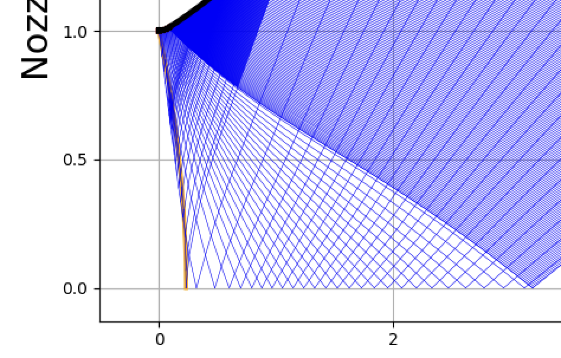

# Функции

<!--toc:start-->
- [Функции](#функции)
  - [Прандтля-Майера](#прандтля-майера)
  - [Число Маха в критике](#число-маха-в-критике)
  - [Вычисление Throat region Mach = 1+ curve parameters](#вычисление-throat-region-mach-1-curve-parameters)
    - [Разбиение радиуса на сегменты](#разбиение-радиуса-на-сегменты)
    - [Параметры сегментов кривой](#параметры-сегментов-кривой)
    - [Расчёт радиусов](#расчёт-радиусов)
    - [Заполнение массива точек](#заполнение-массива-точек)
  - [Вычисление Throat near wall region parameters](#вычисление-throat-near-wall-region-parameters)
    - [Основной цикл по характеристикам](#основной-цикл-по-характеристикам)
    - [Внутренний цикл по характеристикам](#внутренний-цикл-по-характеристикам)
      - [Расчёт первой точки $j = 0$](#расчёт-первой-точки-j-0)
      - [Итеративный процесс уточнения](#итеративный-процесс-уточнения)
    - [Обработка остальных точек $j > 0$](#обработка-остальных-точек-j-0)
      - [Итеративное уточнение параметров для $j > 0$](#итеративное-уточнение-параметров-для-j-0)
<!--toc:end-->

## Прандтля-Майера

$$
\sqrt{\frac{\gamma+1}{\gamma-1}} \cdot \arctan{\left( \frac{(\gamma-1) \cdot \left(M_{\mu}^2-1\right)}{\gamma+1}  \right)} - \arctan{\left( M_{\mu}^2-1 \right)}
$$

$$
q(\lambda) = {\left( {\gamma_{\lambda}+1} \over 2 \right)}^{\dfrac{1}{\gamma_{\lambda}-1}} \cdot \dfrac{\sqrt{\dfrac{\gamma_{\lambda}+1}{2}} \cdot M_{\lambda}}{\sqrt{1+ \dfrac{\gamma_{\lambda}-1}{2}\cdot M_{\lambda}^2}}\ \cdot {\left( 1 - \dfrac{\gamma_{\lambda}-1}{\gamma_{\lambda}+1} \cdot {\left( \sqrt{\dfrac{\gamma_{\lambda}+1}{2}} \cdot M_{\lambda} \over \sqrt{1+ \dfrac{\gamma_{\lambda}-1}{2}\cdot M_{\lambda}^2} \right)}^2 \right)}^{\dfrac{1}{\gamma_{\lambda}-1}}
$$

## Число Маха в критике

$$
\alpha = \sqrt{\dfrac{2}{(\gamma+1) \cdot \rho}},
$$

$$
\nu_s = \varepsilon_s = \dfrac{1}{8} \sqrt{2 (\gamma+1)\dfrac{1}{\rho}},
$$

$$
M_{min} = \sqrt{1 + {(\alpha \cdot \nu_s)}^2},
$$

где $\rho \approx 5$ - радиус переходной части между критикой и сз профилем.

$$
\alpha_0 = \arcsin{\dfrac{1}{M_{min}}}
$$

$$
cst = -\alpha_0 -
 \sqrt{\dfrac{\gamma+1}{\gamma-1}} \cdot
 \arctan{\left(
   \sqrt{\dfrac{\gamma-1}{\gamma+1}} \cdot
   \dfrac{1}{\tan{\alpha_0}}
  \right)},
$$

$$
\theta(\alpha) =
 \sqrt{\dfrac{\gamma+1}{\gamma-1}} \cdot
 \arctan{\left(
   \sqrt{\dfrac{\gamma-1}{\gamma+1}} \cdot
   \dfrac{1}{\tan{\alpha}}
  \right)} +
 \alpha +
 cst,
$$

## Вычисление Throat region Mach = 1+ curve parameters

|  |
| :--: |
| *Рисунок 1: Красным выделен фронт потока с $M=1$* |

В приведённом коде происходит настройка геометрии изопериметрической поверхности в области сопла Лаваля, где число Маха $M = 1$ в горловине и плавно возрастает вдоль оси сопла.

### Разбиение радиуса на сегменты

Переменная `nChar` обозначает количество характеристик (линий). Массив `radii` хранит радиальные координаты точек на горловине, где $M = 1$.

Инициализация массива:

```python
radii = np.zeros(nChar)
radii[0] = 1  # Радиус в первой точке
radii[nChar - 1] = 0  # Радиус в последней точке
```

### Параметры сегментов кривой

Здесь задаются параметры кривой:

- `sn_r1` и `sn_r2` — параметры, которые разделяют горловину на две части.
- `qr` — коэффициент, контролирующий экспоненциальный характер уменьшения радиуса.
- `b1_r1` и `b1_r2` — коэффициенты для вычисления радиусов в каждой части кривой.

Формулы для коэффициентов:
$$
b1\_r1 = sn\_r1 \cdot \frac{qr - 1}{qr^{\left(\frac{nChar}{2} - 1\right)} - 1}
$$
$$
b1\_r2 = sn\_r2 \cdot \frac{qr - 1}{qr^{\left(\frac{nChar}{2}\right)} - 1}
$$

### Расчёт радиусов

1. **Уменьшение радиуса от 1 до `sn_r1`:**

    - Радиус уменьшается экспоненциально:

    ```python
    for i in range(1, int(nChar / 2)):
        r1_current = r1_current - b1_r1 * mt.pow(qr, i - 1)
        radii[i] = r1_current
    ```

 - Формула для радиуса:
    $$
    r_{1}(i) = r_{1\_current} - b1\_r1 \cdot qr^{(i-1)}
 $$

2. **Увеличение радиуса от `sn_r1` до 0:**

    - Радиус увеличивается экспоненциально:

    ```python
    for i in range(1, int(nChar / 2)):
        r2_current = r2_current + b1_r2 * mt.pow(qr, i - 1)
        radii[nChar - (i + 1)] = r2_current
    ```

    - Формула для радиуса:
    $$
    r_{2}(i) = r_{2\_current} + b1\_r2 \cdot qr^{(i-1)}
    $$

### Заполнение массива точек

В конце, массив `ArrayPtsIsoMach` заполняется следующими значениями:

- Радиальная координата `r`: $radii[i]$
- Координата вдоль оси `z`:
  $$z = 2 \cdot \epsilon_s \cdot \left(1 - r^2\right)$$
- Угол $\alpha$:
  $$\alpha = \arcsin{\left(\frac{1}{M\_min}\right)}$$
- Угол $\theta$ задается нулем.

```python
for i in range(nChar):
    ArrayPtsIsoMach[0, i, 0] = radii[i]  # r
    ArrayPtsIsoMach[0, i, 1] = 2 * eps_s * (1 - mt.pow(radii[i], 2))  # z
    ArrayPtsIsoMach[0, i, 2] = mt.asin(1 / M_min)  # alpha
    ArrayPtsIsoMach[0, i, 3] = 0  # theta
```

Таким образом, этот код формирует кривую для горловины сопла, где число Маха в каждой точке равно или больше 1, и описывает геометрию соответствующего изопериметрического сечения.

## Вычисление Throat near wall region parameters

Этот фрагмент кода занимается настройкой параметров в области горловины сопла, близкой к стенке, путём итеративного расчёта характеристик (радиуса, координаты, углов) для каждой точки. Давайте подробно рассмотрим, что происходит в каждой части кода.

### Основной цикл по характеристикам

```python
for i in tqdm(range(1, nChar), desc="Processing i"):
    if theta_current > theta_new:
        nCharMax = i - 1
        break
```

Цикл `for i in range(1, nChar)` перебирает характеристики вдоль оси сопла. Если текущий угол $\theta$ превышает новое значение угла $\theta_{\text{new}}$, итерация завершается.

### Внутренний цикл по характеристикам

```python
for j in range(nChar - i):
```

Внутренний цикл проходит по всем характеристикам для текущей итерации `i`.

#### Расчёт первой точки $j = 0$

```python
if j == 0:
    epsilon = 0.1

    y_M = ArrayPtsIsoMach[i - 1, j, 0]
    x_M = ArrayPtsIsoMach[i - 1, j, 1]
    alpha_M = ArrayPtsIsoMach[i - 1, j, 2]
    theta_M = ArrayPtsIsoMach[i - 1, j, 3]

    y_k = ArrayPtsIsoMach[i - 1, j + 1, 0]
    x_k = ArrayPtsIsoMach[i - 1, j + 1, 1]
    alpha_k = ArrayPtsIsoMach[i - 1, j + 1, 2]
    theta_k = ArrayPtsIsoMach[i - 1, j + 1, 3]

    y_m_current = y_M + r * (1 - mt.cos(theta_new))
    x_m_current = x_M + r * mt.sin(theta_new)
    alpha_m_current = alpha_M
    theta_m_current = thetafromalpha(gamma, alpha_m_current)
```

Этот блок кода задаёт начальные значения параметров для первой точки `j=0`. Значения радиуса и координаты по оси рассчитываются на основе угла $\theta_{new}$. Здесь используется предположение, что $\alpha_{m\_current} = \alpha_{M}$.

#### Итеративный процесс уточнения

```python
while epsilon > 1e-5:
    theta_m_new = mt.acos(1 - (y_m_current - 1) / r)
    phi2 = (theta_M + theta_m_new) / 2
    phi1 = (theta_m_new + theta_k) / 2 + (alpha_m_current + alpha_k) / 2
    x_m_new = (y_M - y_k - x_M * mt.tan(phi2) + x_k * mt.tan(phi1)) / (mt.tan(phi1) - mt.tan(phi2))
    y_m_new = y_M + (x_m_new - x_M) * mt.tan((theta_M + theta_m_new) / 2)
    epsilon = (
        mt.pow((theta_m_new - theta_m_current) / (theta_m_current + 1e-10), 2)
        + mt.pow((y_m_new - y_m_current) / (y_m_current + 1e-10), 2)
        + mt.pow((x_m_new - x_m_current) / (x_m_current + 1e-10), 2)
    )
    if epsilon < 1e-5:
        theta_current = theta_m_new
        if theta_current > theta_new:
            break
        ArrayPtsIsoMach[i, j, 0] = y_m_new
        ArrayPtsIsoMach[i, j, 1] = x_m_new
        ArrayPtsIsoMach[i, j, 2] = alphafromtheta(theta_m_new)
        ArrayPtsIsoMach[i, j, 3] = theta_m_new
    else:
        y_m_current = y_m_new
        x_m_current = x_m_new
        theta_m_current = theta_m_new
```

Здесь происходит итеративное уточнение координат и углов с целью минимизации ошибки $\epsilon$. Итерация продолжается до тех пор, пока ошибка не станет достаточно малой ($\epsilon < 1e-5$).

### Обработка остальных точек $j > 0$

```python
else:
    epsilon = 0.1
    r0 = ArrayPtsIsoMach[i, j - 1, 0]
    z0 = ArrayPtsIsoMach[i, j - 1, 1]
    alpha0 = ArrayPtsIsoMach[i, j - 1, 2]
    theta0 = ArrayPtsIsoMach[i, j - 1, 3]

    r1 = ArrayPtsIsoMach[i - 1, j + 1, 0]
    z1 = ArrayPtsIsoMach[i - 1, j + 1, 1]
    alpha1 = ArrayPtsIsoMach[i - 1, j + 1, 2]
    theta1 = ArrayPtsIsoMach[i - 1, j + 1, 3]

    r2_current = (r0 + r1) / 2
    z2_current = (z0 + z1) / 2
    alpha2_current = (alpha0 + alpha1) / 2
    theta2_current = (theta0 + theta1) / 2
```

Для остальных точек (где $j > 0$) начальные значения рассчитываются как среднее между предыдущей и следующей точкой.

#### Итеративное уточнение параметров для $j > 0$

```python
while epsilon > 0.00001:
    m = 0.5 * (1 / mt.tan(theta1 + alpha1) + 1 / mt.tan(theta2_current + alpha2_current))
    n = 0.5 * (mt.tan(theta0 - alpha0) + mt.tan(theta2_current - alpha2_current))
    K = 0.5 * ((1 + mt.cos(2 * alpha1)) / (gamma - mt.cos(2 * alpha1)) + (1 + mt.cos(2 * alpha2_current)) / (gamma - mt.cos(2 * alpha2_current)))

    if r1 == 0.0:
        L = (0.5 / r2_current) * (0.5 * (alpha1 - alpha2_current) * (1 + mt.cos(2 * alpha1)) / (gamma - mt.cos(2 * alpha1)) + mt.sin(alpha2_current) * mt.sin(theta2_current) / mt.sin(theta2_current + alpha2_current))
    else:
        L = 0.5 * (mt.sin(alpha1) * mt.sin(theta1) / (r1 * mt.sin(theta1 + alpha1)) + mt.sin(alpha2_current) * mt.sin(theta2_current) / (r2_current * mt.sin(theta2_current + alpha2_current)))

    M = 0.5 * ((1 + mt.cos(2 * alpha0)) / (gamma - mt.cos(2 * alpha0)) + (1 + mt.cos(2 * alpha2_current)) / (gamma - mt.cos(2 * alpha2_current)))
    N = 0.5 * (mt.sin(alpha0) * mt.sin(theta0) / (r0 * mt.cos(theta0 - alpha0)) + mt.sin(alpha2_current) * mt.sin(theta2_current) / (r2_current * mt.cos(theta2_current - alpha2_current)))

    z2_new = (z1 - m * n * z0 + m * (r0 - r1)) / (1 - m * n)
    r2_new = (r0 - m * n * r1 + n * (z1 - z0)) / (1 - m * n)
    alpha2_new = (theta1 - theta0 + K * alpha1 + M * alpha0 + L * (r1 - r2_current) + N * (z0 - z2_current)) / (M + K)
    theta2_new = (M * (theta1 + K * alpha1 - L * (r2_current - r1)) + K * (theta0 - M * alpha0 + N * (z2_current - z0))) / (M + K)
    epsilon = (
        mt.pow((r2_new - r2_current) / (r2_current + 1e-10), 2)
        + mt.pow((z2_new - z2_current) / (z2_current + 1e-10), 2)
        + mt.pow((alpha2_new - alpha2_current) / (alpha2_current + 1e-10), 2)
        + mt.pow((theta2_new - theta2_current) / (theta2_current + 1e-10), 2)
    )
    if epsilon < 0.00001:
        ArrayPtsIsoMach[i, j, 0] = r2_new
        ArrayPtsIsoMach[i, j, 1] = z2_new
        ArrayPtsIsoMach[i, j, 2] = alpha2_new
        ArrayPtsIsoMach[i, j, 3] = theta2_new
    else:
        z2_current = z2_new

